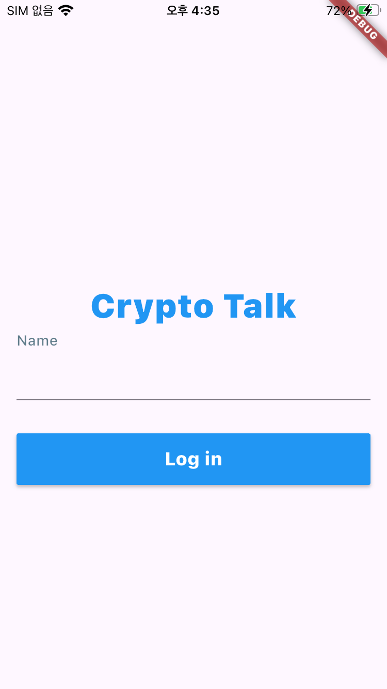
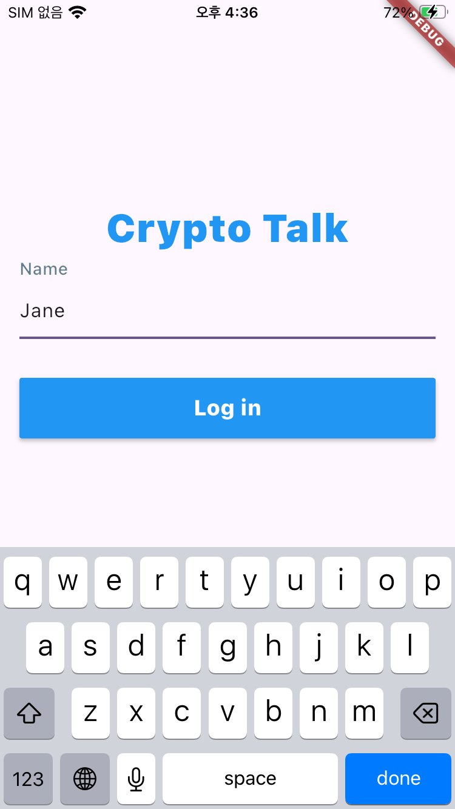
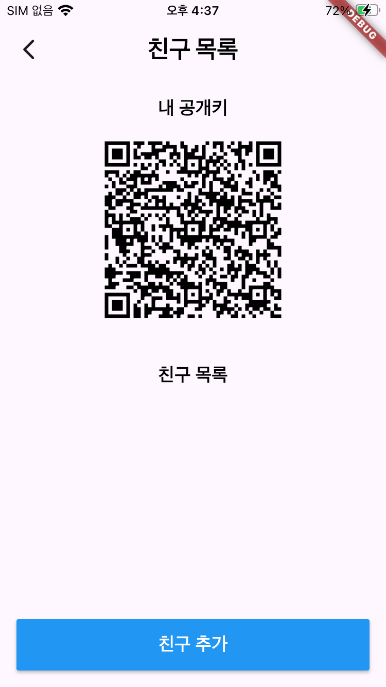
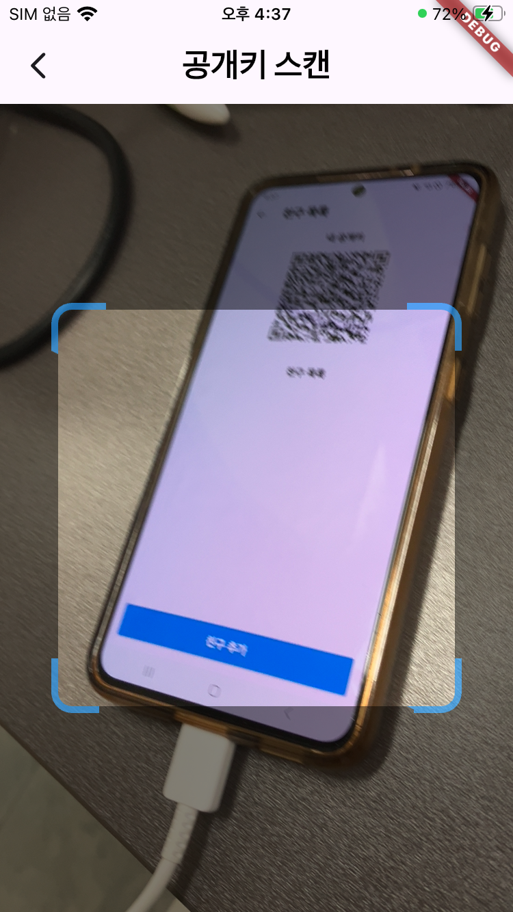
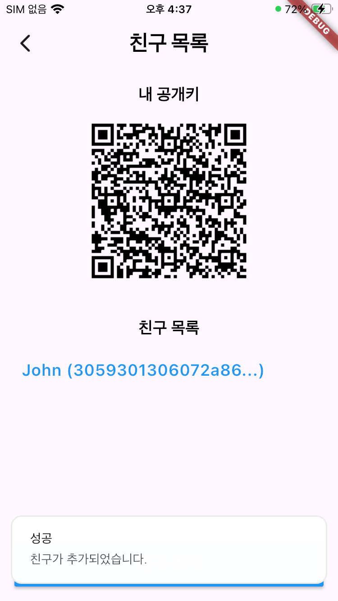
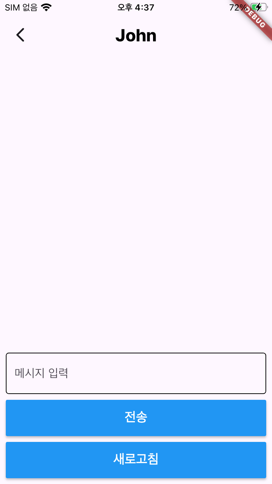
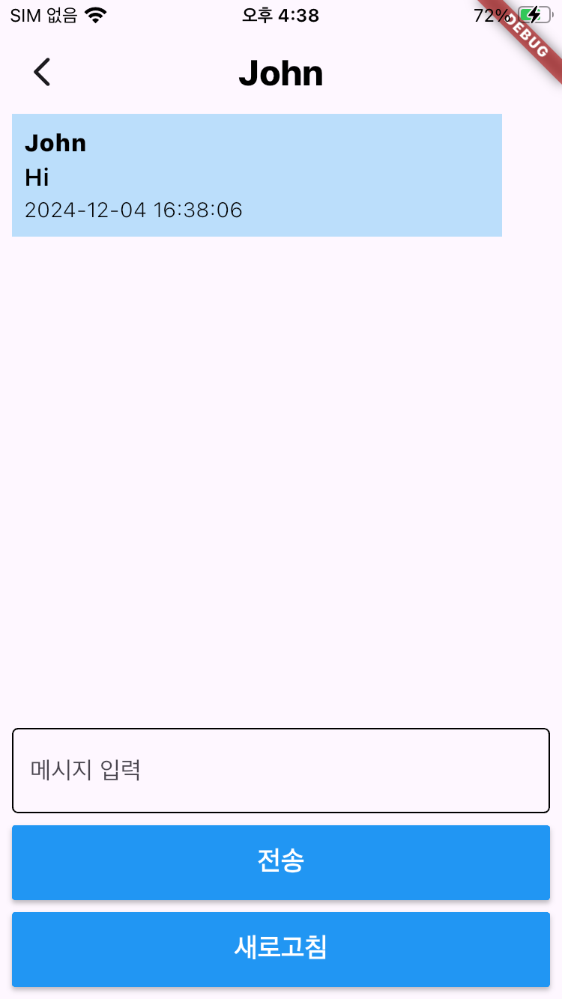
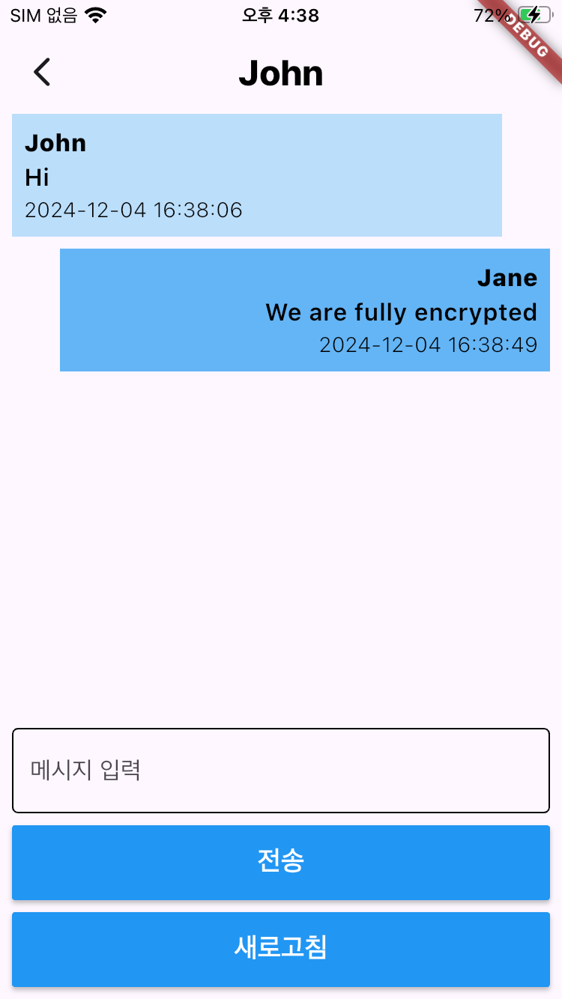

# CryptoTalk

## The single most secure chat app you have ever witnessed in the market

### This is a tutorial project intended for practicing the real-life digital cryptography
### If you want to learn how cryptography is implemented in an actual product,
### you're in the right place.
 
## What's this app?
CryptoTalk is a fully-encrypted chat app.
You sign in with your name and you will be given an asymmetric key pair.
You can add a new friend by scanning the QR of his/her public key.
You can send messages that are encrypted with shared secret.
Only you and your friend can decrypt your messages.

## Components
- ***cryptotalk-server***: Spring(Java)
- ***cryptotalk-app***: Flutter(Dart)
  
## How to test
1. Run cryptotalk-server
2. Host the server (ie. via ngrok)
3. Change the **HOST_URL** to your own endpoint
    ***(cryptotalk-app > lib > common > api.dart)***
4. Run cryptotalk-app

## You can experience
1. EC key generation (on P-256 curve, a.k.a. secp256r1, prime256v1)
2. ECDH key exchange
3. ECDSA signature and verification
4. AES-256-GCM en/decryption
5. **Java BouncyCastle** & **Dart PointyCastle** compatibility

## Usage tutorial

1. Once you run the app, this will be the first screen you will see.

2. Enter your favored name.

3. Once you tap 'log in' button, you will be guided to a friend list screen.

4. Tap '친구 추가' button, and scan the QR code of the friend you'd like to chat with.

5. Once you scanned the code, you will be guided back to the previous screen and find your friend in the list.

6. Tap your friend and enter the chat screen

7. CryptoTalk doesn't support real-time message pulling, so you have to tap '새로고침' manually to refresh the messages.

8. You can type your message and tap '전송' button and all messages will be refreshed.

9. If you look up the DB through h2-console, you'll see there are two users inserted: you and your friend.
 
 
10. Also, you'll see the messages you've sent and received are stored in encrypted form and there's nothing that can decrypt this message in the DB.
